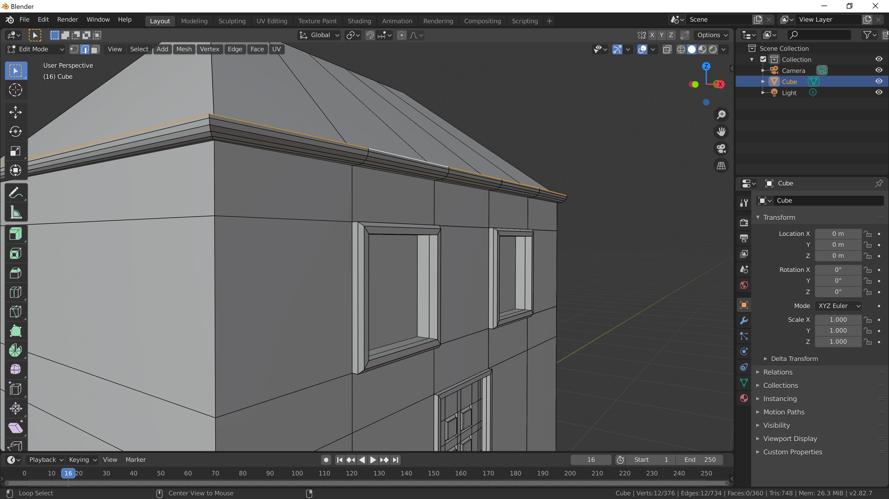

[Contents page](../graphics.md)

# CHALLENGE - Editing

We've added some basic detail to our house but there's lots more you could add.

For example, I've added a gutter around the edge of the room using the extrude and bevel tools.

Have a think about what you could add to your house and give it a go!
If you're not sure how to create something give it a go (save first) and if you're still stuck ask on Slack or jump back into the zoom room.

You can have more than one object that you edit in a scene so don't be restricted to just editing the house.  You could make a fence for the front garden.  Press <kbd>Tab</kbd> to get out of edit mode, add a new object and, with it selected, press <kbd>Tab</kbd> to edit the new object.

Send a picture on the Slack graphics group if you make something cool!
