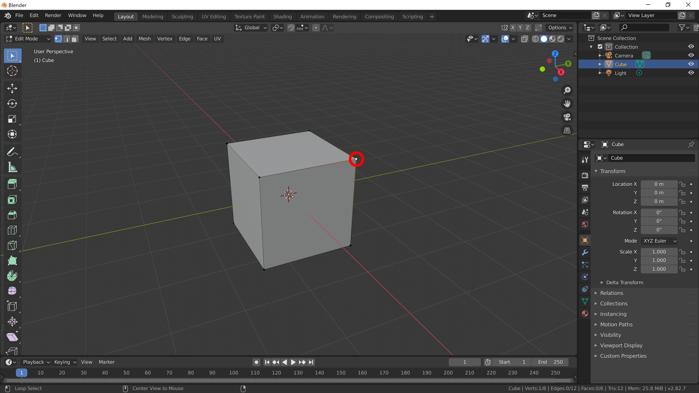
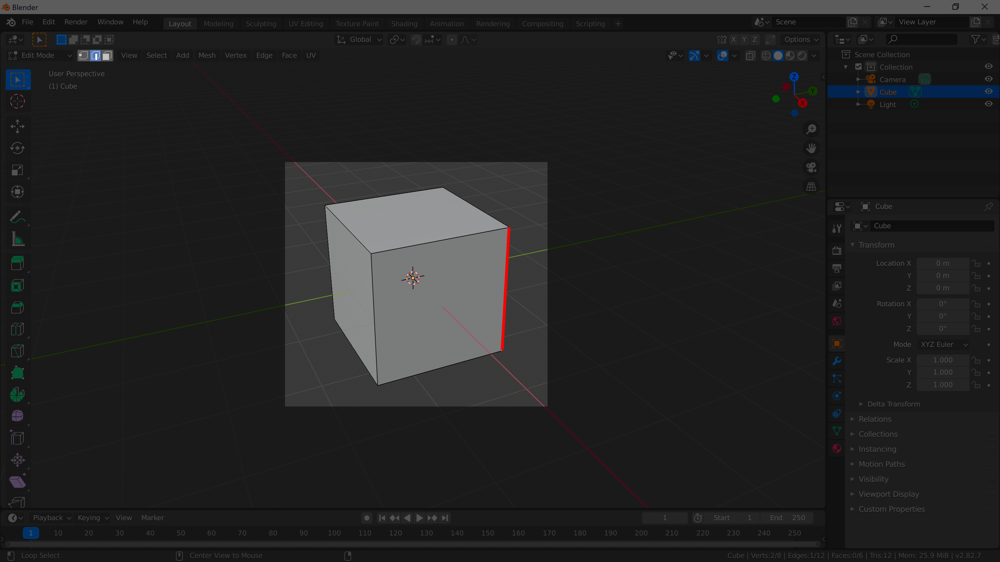
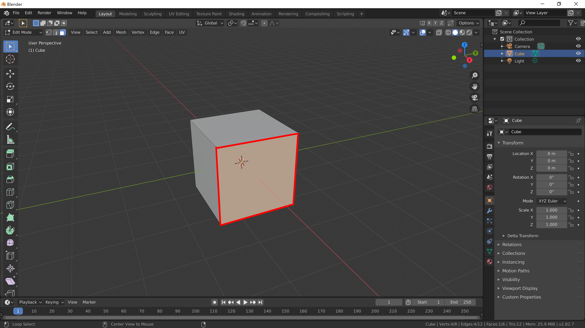
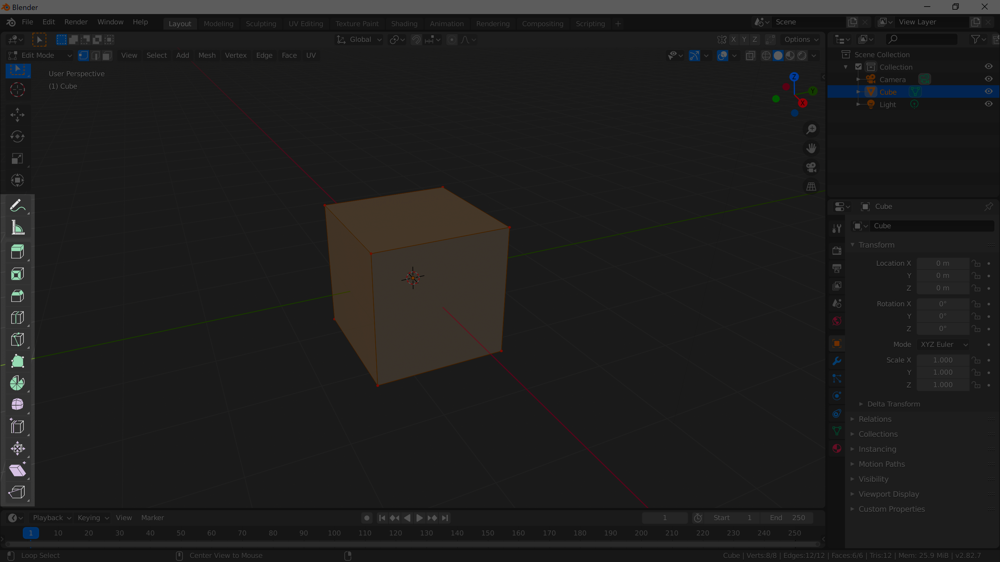
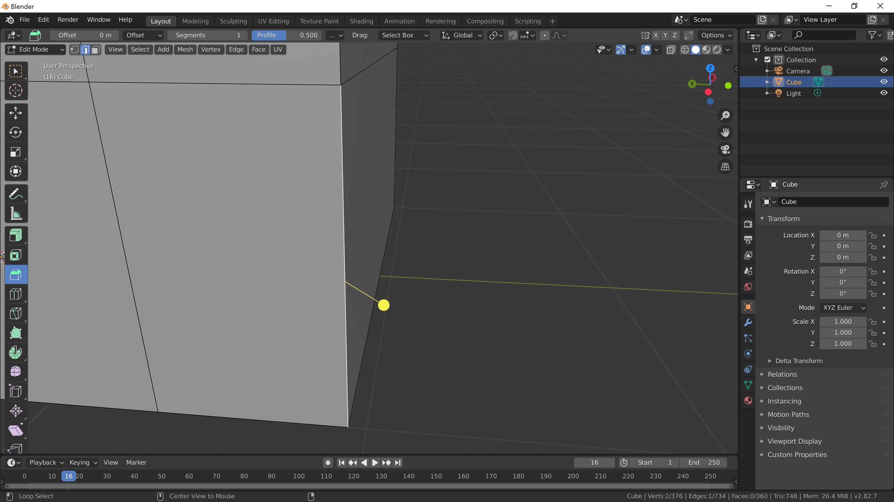
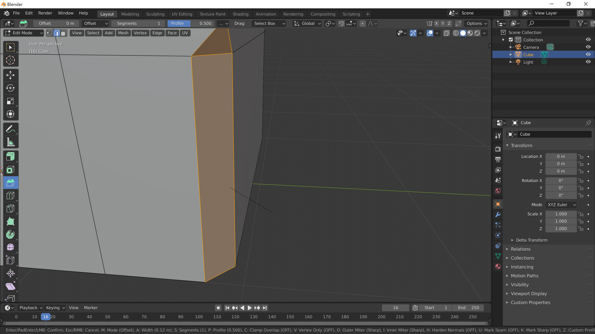
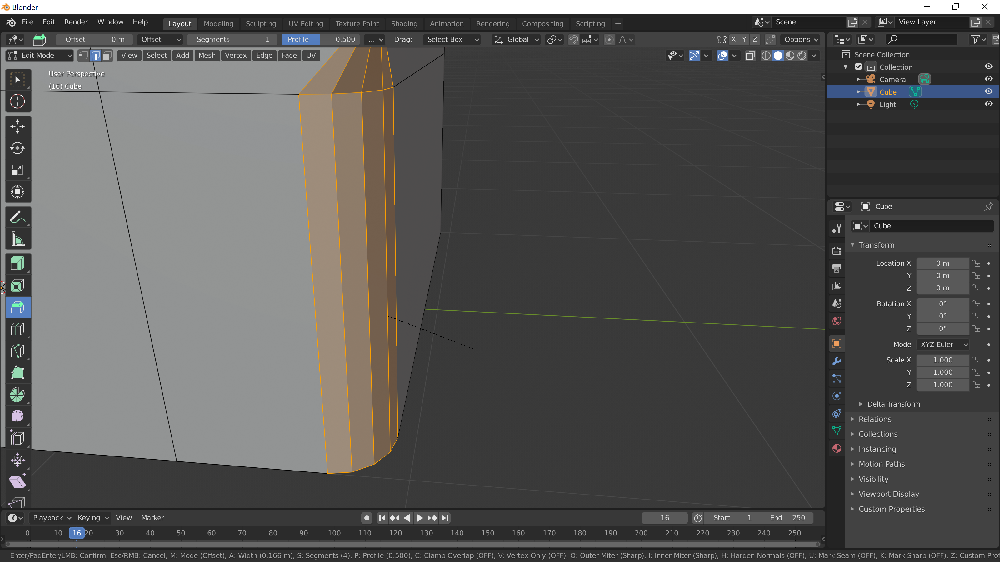

[Contents page](../graphics.md)

# LEARN - Editing meshes

So far we've just used simple shapes like cubes and spheres but what if we want to create something a bit more interesting?
This is where we need to use edit mode.  Select an object so it's got an orange outline and press <kbd>Tab</kbd>.

An object is made up of vertices, edges and faces.  The vertices are the points you see at the corners.
When in edit mode you can select and move these just like you move objects around.

By default you'll be able to select vertices.  To select edges and faces you'll need to change the setting in the top left of the viewport.

Vertex:

Edge:

Face:

When you change to edit mode you'll see the tools on the left of the viewport change.  Hover you cursor over the icons for each tool to see their name.

Look for a tool called "Extrude Region".  Give it a go and see what happens!
If you can't see anything to click on once you've selected the tool then try selecting some faces.

Loop cut is another tool that's really useful.  With this one you have to hover your cursor over the object once the tool is selected to see what it will do.
With this tool you can move where the cut is applied by clicking and holding down then dragging the cut up and down.

In real life lots of things don't have perfectly sharp corners but are actually slightly rounded.
To round off the edges in our models we need to use the "Bevel" tool.
Select edge selection mode and select some edges to try this tool on.  To select more than one thing in Blender you can hold down <kbd>Shift</kbd> and left click on each item.
When you select the Bevel tool the handle will pop up in the viewport like this:

Once you grab the handle you'll get a simple bevel like this:

While you hold down <kbd>LMB</kbd> scroll the mouse wheel and you'll get a smoother edge.

Have a go and see what you can create.

Once you're happy with this move on to [build a house](practice.md).

Official Blender documentation for [meshes](https://docs.blender.org/manual/en/latest/modeling/meshes/index.html).
