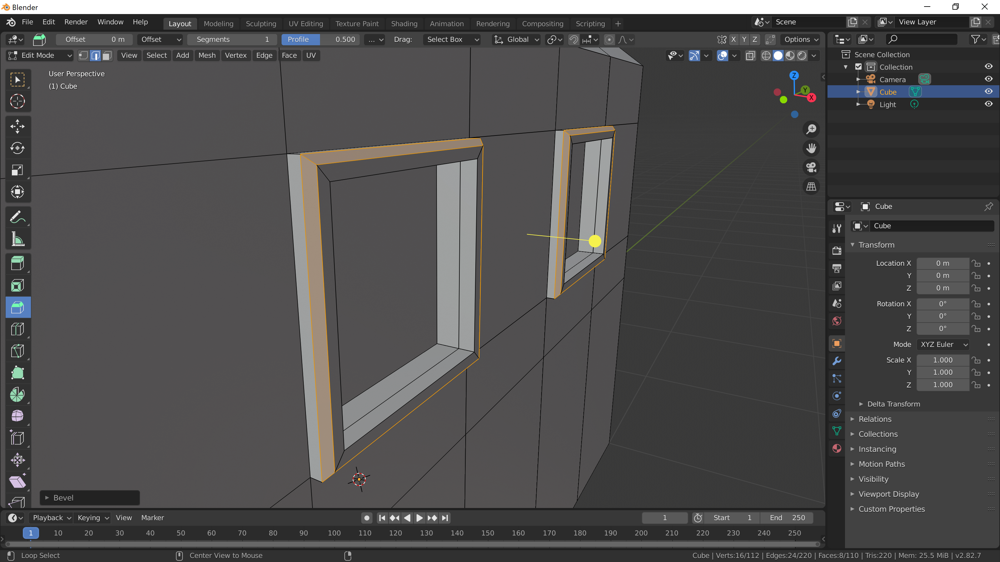

[Contents page](../graphics.md)

# PRACTICE - Editing

To practice what we've just learned lets make something like this:

We don't need anything else in our scene so delete everything before we begin. Press <kbd>a</kbd> until everything is selected then hit <kbd>x</kbd> to delete.

A house is roughly box shaped so lets start by adding a cube.
Go to edit mode (<kbd>Tab</kbd>).  Once there you can stretch the cube out to make it rectangular.

Next lets use the "Inset Faces" tool to create a roof.  Inset the top face and then move it upwards to make our roof.

Next we want to start adding details like windows and a door.  Use the "Loop Cut" tool to achieve something like this:

Remember that you can click and drag with this tool to choose where to cut.

Now select the faces that we want to make into windows (you can select more than one thing with <kbd>Shift</kbd>).

With more than one thing selected you can use the inset and extrude tools on both in one go.  Use them to make some window frames:

Most window frames won't be so boxy so lets switch the edge select mode (top left of the viewport), select the edges around the outer edge of the frame and use the bevel tool to round them off a bit.

Ok, your turn!  Think about what your front door looks like (maybe even do take a look - having a good reference is important!) and see if you can recreate it.  If you want to focus on just the part of our mesh that is going to be our front door you can press <kbd>Shift</kbd>+<kbd>H</kbd> to hide everything except the selected face.  When you want to see everything again hit <kbd>Alt</kbd>+<kbd>H</kbd>.

This is what my front door looks like!

For an extra challenge have a go at [this](challenge.md).
