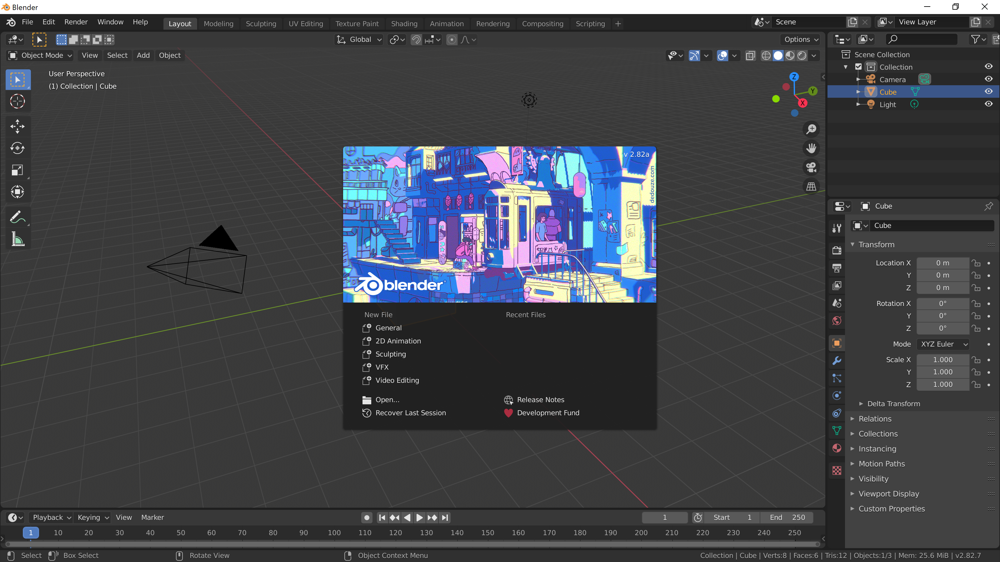
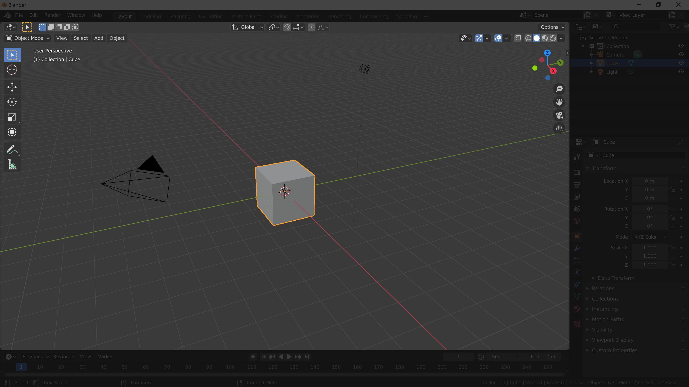
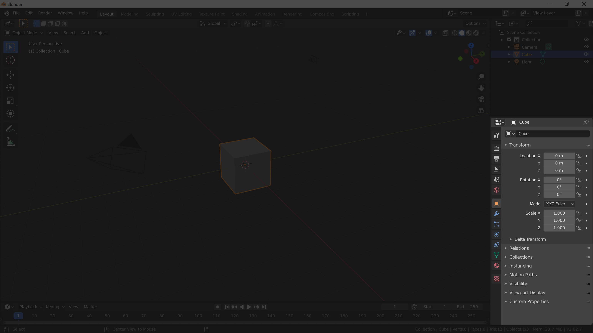
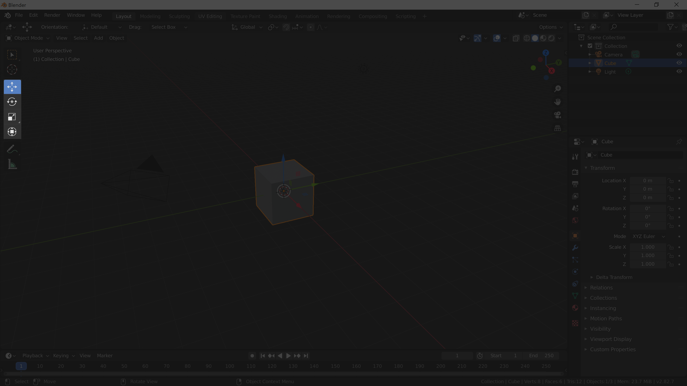
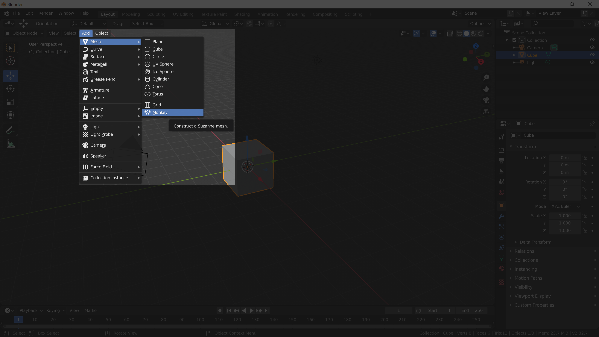
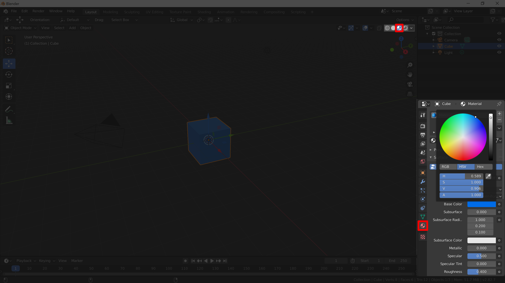

[Contents page](../graphics.md)

# LEARN - UI and navigation

Fire up Blender and you should get something that looks like this:

Click anywhere outside the popup and it will disappear.

The main thing you can see is called the "Viewport".  This is where you see the things that are in your scene.

Hold down your <kbd>MMB</kbd> middle mouse button (click down on the scroll wheel) and move your mouse around to change your view of the scene.

The orange outline shows you what you've got selected in your scene.  Try using your <kbd>LMB</kbd> left mouse click to select some of the other things in your scene.  In the start up file you'll have a cube, a camera and a light.
Notice as you change what is selected the properties on the right hand side change.

Try selecting your cube and then grab one of the numbers <kbd>LMB</kbd> in the properties panel and see what happens when you change it.

Like most programs you can press <kbd>Ctrl</kbd>+<kbd>Z</kbd> to undo changes.

On the left side of the viewport you can turn on "gizmos".
Some controls will appear around your selected object that you can click and drag.

Cubes and cameras aren't very exciting so let's add some other object.  The monkey is particularly fun!

Now we've started work on a scene it's time to save.  Fit File > Save As, find a sensible place to save your work and give it a descriptive name.  Something like "LiveWires introduction.blend" would be good for this.

If you want to delete an object you need to select it, hit <kbd>X</kbd> and then click delete in the popup.

Next lets add some colour to our objects. First we need to tell Blender that we want to see objects colours.  In the top right hand corner of the viewport there are 4 buttons with sphere icons.  Select the third from the left, which is called "Material preview".

Now we can see colours on the objects but we haven't given any objects a colour yet.  Select an object (<kbd>LMD</kbd>) and in the properties panel go to the "Material properties" tab, which has a small red checked sphere icon.  If there aren't any settings in this panel then you can press the "New" button to add them.  Adjust the "base colour" and you'll see the object change in the viewport.

Once you're happy with this move on to the [next section](practice.md) to practice what you've just learned.  You can come back to this page at any time if you forget how to do something.

Official Blender documentation for the [User Interface](https://docs.blender.org/manual/en/latest/interface/index.html) and [Scenes & Objects](https://docs.blender.org/manual/en/latest/scene_layout/index.html).
