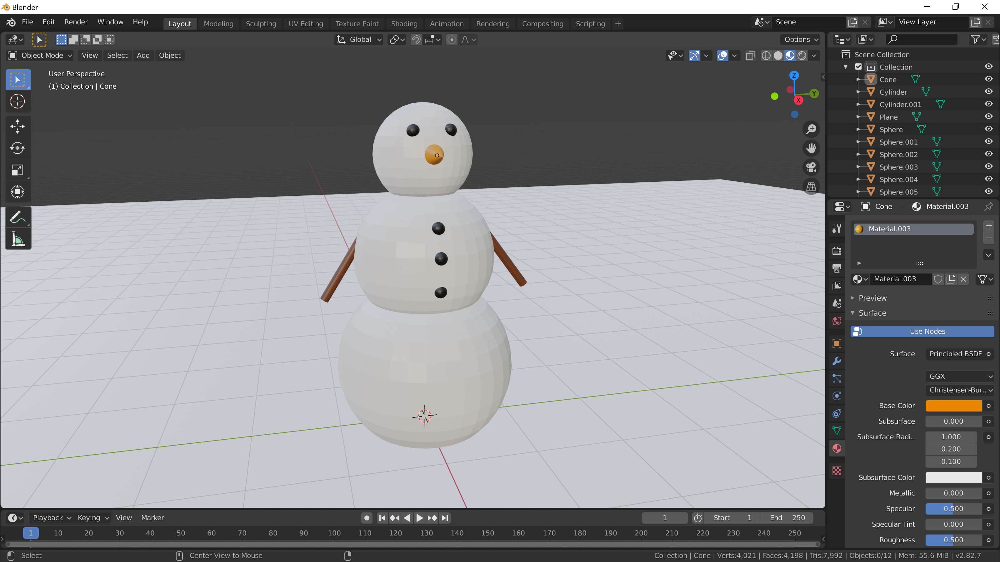

[Contents page](../graphics.md)

# PRACTICE - UI and navigation

Now you've had a bit of an explore try and make yourself a simple scene that looks something like this:

You'll need to use everything we've learned so far to make some different shaped objects, move them around and add some colour.  Once you've got a good looking snowman why not add some other things to your scene.  For example, the snowman is probably in the garden so create a shed or some plants.

Well done if you've made it this far!  Take a screenshot and drop it into the graphics channel on Slack so we can all see what you've been working on.  For instructions on taking screenshots of areas of your screen see [this](../screenshot.md).

If you'd like an extra challenge have a go at [this](challenge.md).
