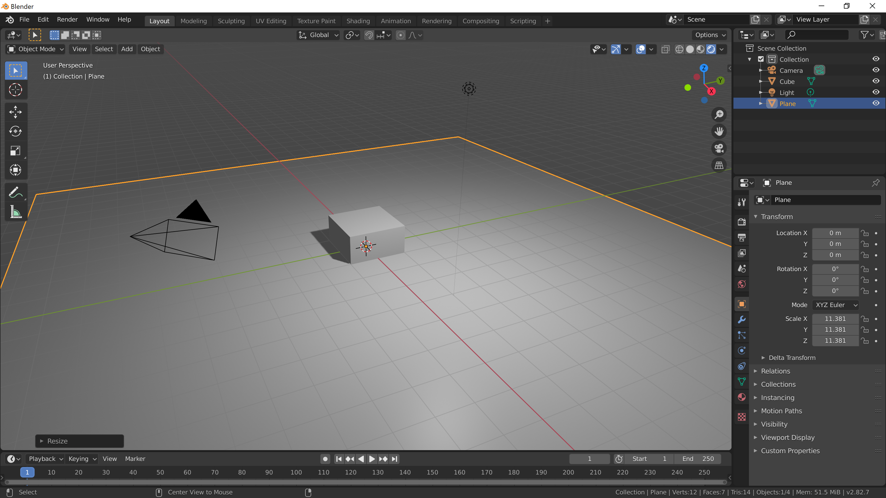

[Contents page](../graphics.md)

# LEARN - Rendering

Blender offers 2 fantastic renders called Cycles and Eevee.
For what we're doing we'll be using Eevee as it's really fast.

To see a preview of Eevee all you have to do is hit "Rendered" in the top right corner of the viewport.
You'll still see all the controls in the viewport but the lighting is now being handled by Eevee.

To make it a bit more obvious lets add a ground so that we can see the shadows.

<kbd>Shift</kbd>+<kbd>A</kbd> > Mesh > Plane

You might have to scale it up (<kbd>S</kbd>).

At the moment we've got one light source in the scene.
You can add more from the same menu where you add objects.
There are 4 different types of lights.  Try creating each one and see what it does.

With a light selected you can edit it's settings in the "Light" properties panel.

The "Sun", "Spot" and "Area" lamps have little yellow handles that you can click and drag to point the light.

Next you'll need a camera.  You create this from the same "Add" menu as before.
You can select the camera and move it around like any other object.
Press <kbd>0</kbd> on the numpad to look through the cameras view.

When you're ready press <kbd>F12</kbd> to create the render.  From the window that pops up you can choose to save the image to a file.

Have a go!  A fun exercise is to think of a theme and try lighting your scene to match the theme.  For example, "sinister villain" might look like this:

