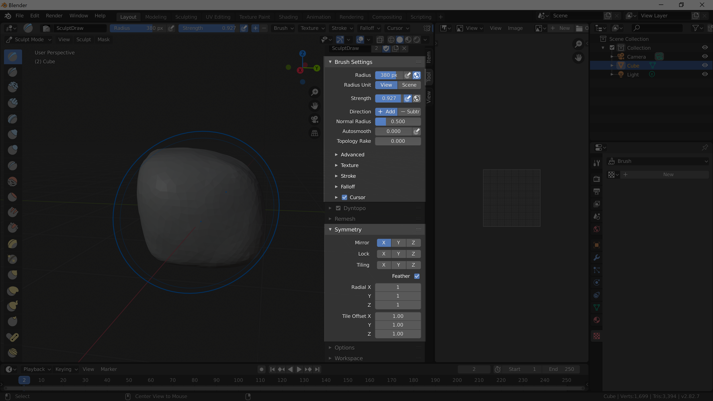

[Contents page](../graphics.md)

# CHALLENGE - Sculpting

Each sculpt brush has lots of extra settings that you can play with to achieve some interesting results.

Have an experiment and see what you can achieve.
The texture and falloff tabs are particularly good.

Using symmetry well can be a powerful tool for creating neat models quickly.
You'll have noticed the default symmetry settings when you started but this panel allows you to adjust the symmetry
(or turn it off entirely).

Spend some time using these tools to improve your model (and send us a screenshot of what you make!).
