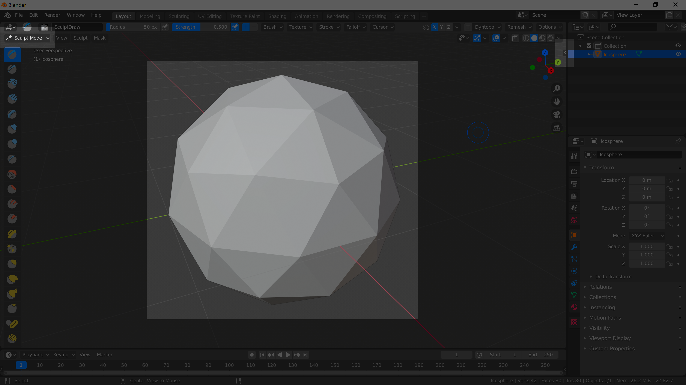
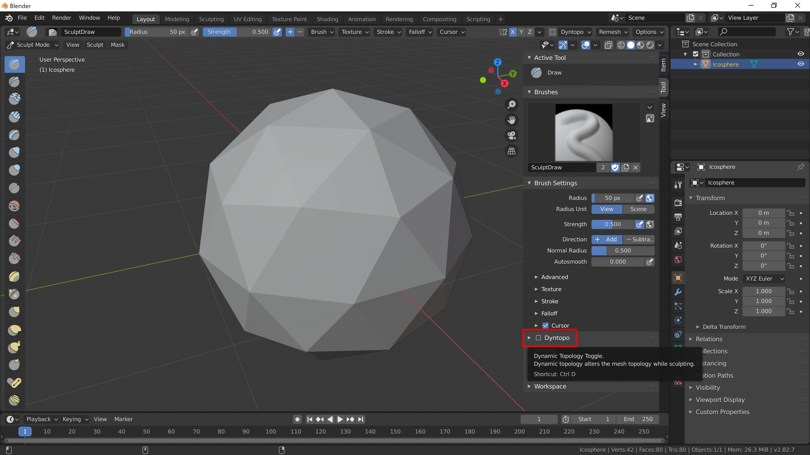

[Contents page](../graphics.md)

# LEARN - Sculpting

So we've learned how to edit meshes.  The method we've seen already is great for making solid objects like houses, computers, swords etc... But what if we want to make more organic looking things?  This is where sculpting comes in.

Sculpt mode is just like edit mode.  Use the drop down in the top left of the viewport to change to sculpt mode.

A sphere is a good place to start so let's create a sphere, select it and change to edit mode.  There are some options in the panel on the right side of the viewport that will be useful.  If the panel isn't expanded click on the little arrow to expand it.

Once you've done that you just need to check this box so you can sculpt the object like a lump of clay.

You're ready to go!  On the left side of the viewport there are loads of different sculpting tools.
The best way to find out what they do it just to give them a go.
Have a play about with them and don't worry about making anything that looks good at the moment.
Once you're ready you can create a new object (remembering to check "dyntopo" again) and start properly.

Now [have a go](practice.md) yourself.

Official Blender documentation for [sculpting](https://docs.blender.org/manual/en/latest/sculpt_paint/sculpting/index.html).
