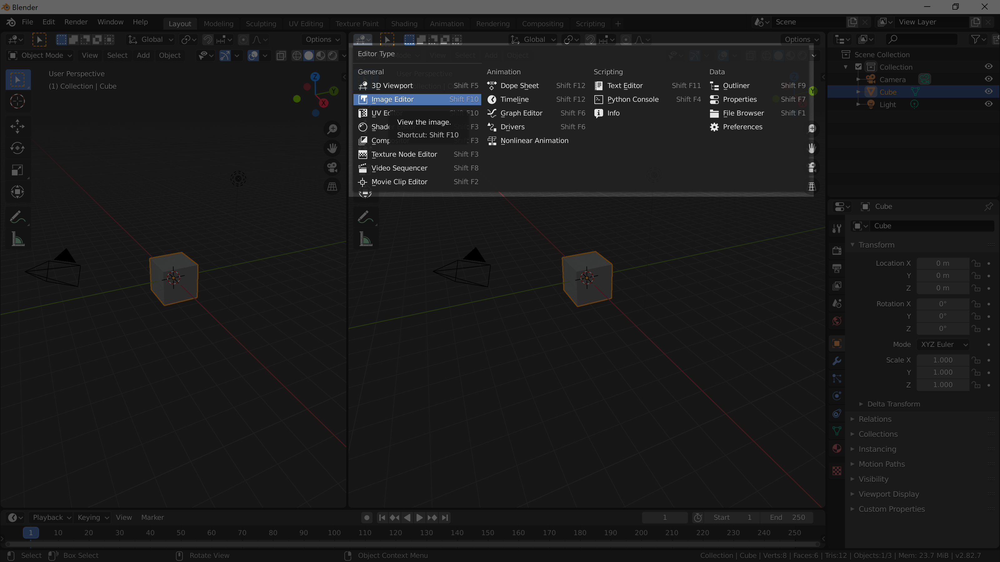
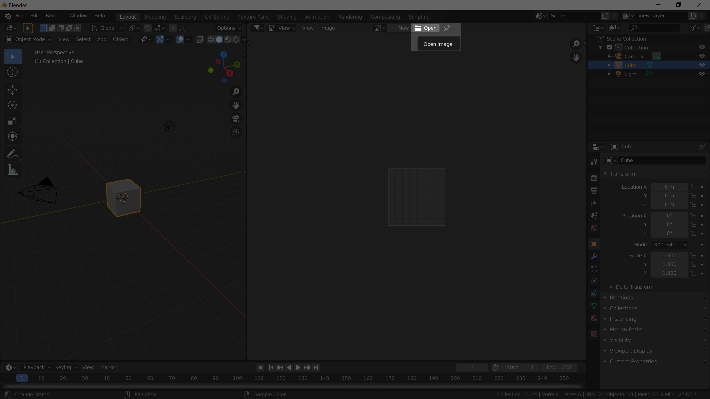

[Contents page](../graphics.md)

# PRACTICE - Sculpting

Now that we've got the basics of sculpting lets just dive in and give it a go!

Have a quick Google search for images and find something that you'd like to make.
In the past things like Pokémon, Nintendo characters and art sculptures have made good subjects to be sculpted.
Once you found some good reference images for what you want to make you're ready to get started.

Sometimes it can be helpful to have your images right inside Blender so you can look at them easily while you're working.
Save your references somewhere sensible and then in Blender open them in an image editor.

To make a new window hover your cursor over the top right edge of the viewport (your cursor will change to look like "+") then click and drag to make a new window.  To change your new window to an image editor click the dropdown in the top left corner of the viewport and select "Image Editor".

You can make more than one image editor window.

If you're stuck for ideas jump on Slack and see if anyone else can suggest something.

Most of the time it's going to be easy to start your sculpt from a sphere and work from there.
To speed up your process you could also use the techniques we learned [last time](../Editing/learn.md) to make yourself
a rough starting point that then move back to sculpt mode to add the detail.

Once you've had a go you can have a look at the [challenge](challenge.md) to explore some other sculpt settings.
