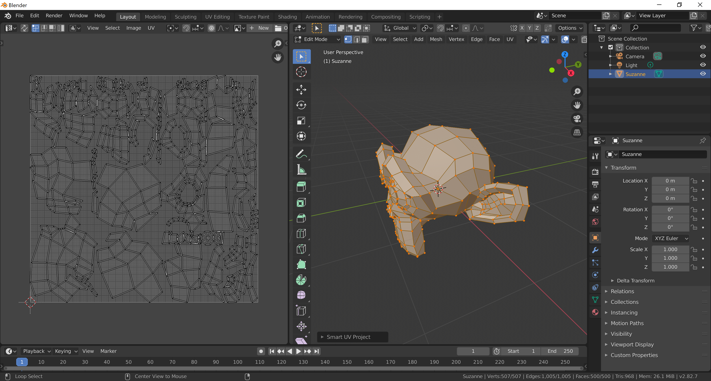
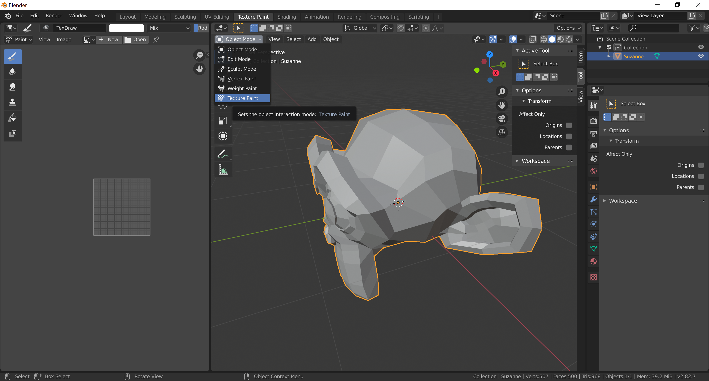
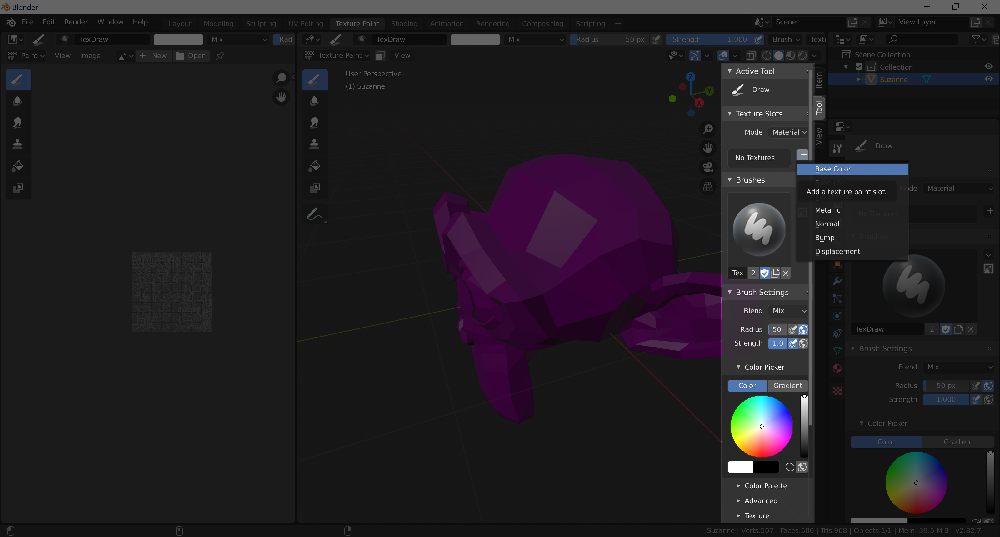
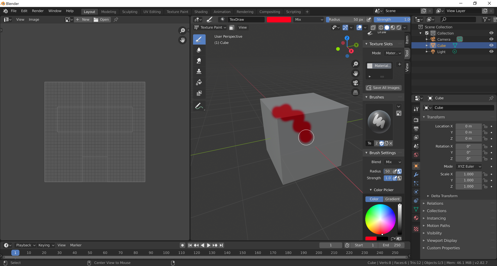

[Contents page](../graphics.md)

# LEARN - Texturing

So far we've only been able to colour each object with one colour.
What we really want is to be able to paint on our objects.

First we have to understand that we're just painting a regular 2D image and that gets stretched over our 3D model.
Imagine making a cube from a piece of paper.  You'd cut out 6 squares in a cross arrangement.

Blender does a pretty good job of automatically unwrapping your models for you.  To do this open a new window but instead of making it an "Image Editor" we instead want a "UV Editor".
Next select your object in the viewport and go to edit mode <kbd>Tab</kbd>.
Select everything <kbd>A</kbd>, press <kbd>F3</kbd> to search commands and search for "Smart UV Project".

You should end up with something like this:

To be able to move on it's important that this is correct so if you're not sure send us a picture on Slack or jump back on Zoom.
Once UV unwrapping is complete you can't go back to modelling without breaking any work you do on the texture painting so
make sure you're happy with your model before you move on to this step.

Like editing and sculpting there is a mode for texture painting.
Let's change to that mode now using the dropdown in the top left corner of the viewport.

One last thing to do before we can start painting.  We need to tell Blender what it is we want to paint.
To start with we just want to paint "Base Color".  When a box for settings pops up you can just press "OK".

And now you're ready to paint!  Like sculpting you can change the brush settings.
To do this with painting you change the settings in the "Brush Settings" menu on the right.
The main one you'll want to change to begin with is the colour.

Next [give it a go](practice.md) on your own model.

Official Blender documentation for [texturing](https://docs.blender.org/manual/en/latest/sculpt_paint/texture_paint/index.html).
