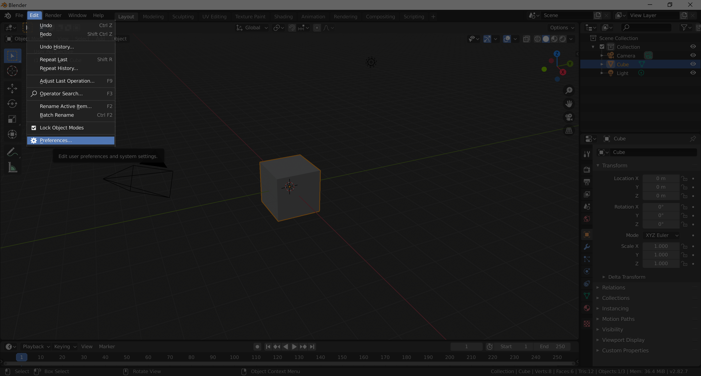
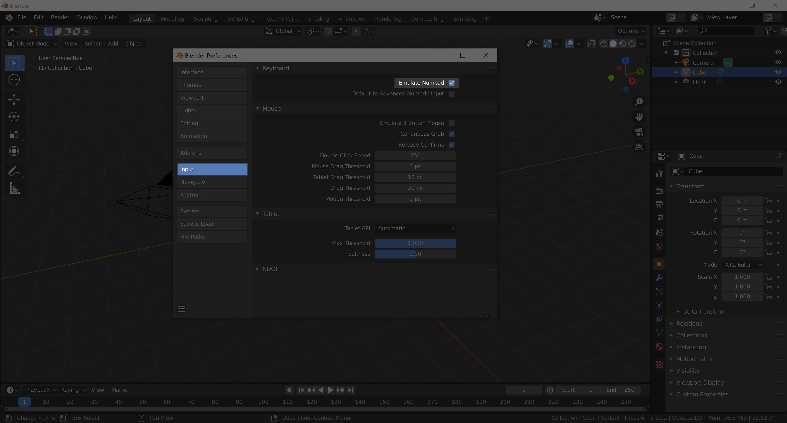

# Installation

Head over to [blender.org/download](https://www.blender.org/download/) and download the latest installer (big blue button in the middle of the screen).

For using Blender you will want a mouse you can plug in.  You'll struggle with just a trackpad.
If you don't have a numpad on your keyboard you should turn on "Emulate Numpad".
Once this is turned on whenever you see <kbd>numpad-0</kbd> you should press the normal <kbd>0</kbd> key instead.

