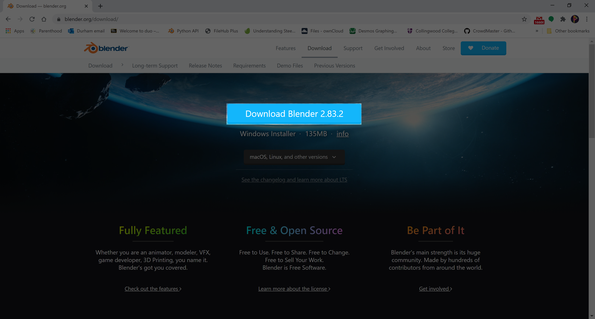

# Installation

Head over to [blender.org/download](https://www.blender.org/download/) and download the latest installer (big blue button in the middle of the screen).

For using Blender you will want a mouse you can plug in.  You'll struggle with just a trackpad.
A keyboard with a numpad would also be helpful but isn't essential.
